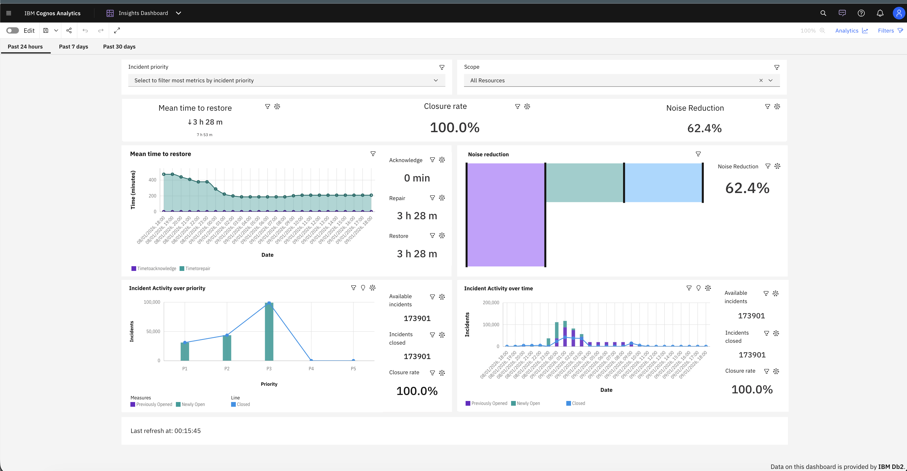

# AIOps Insights CA Dashboard


AIOps Insights CA dashboard is a randition of the [AIOps Insights](https://www.ibm.com/docs/en/cloud-paks/cloud-pak-aiops/latest?topic=insights-aiops-ui) capability re-imagined with Db2 and CA (Cognos Analytics). The CA dashboard offers visualizations of much the same AIOps processing metrics as the in-product dashboard. It does have a limitation of not presenting the runbook-related metrics but it makes up for in the flexibility to customize the dashboard at will with schema modifications and further visualization extensions via CA visualization library. 

### Files
[AIOps_Insights_CA_Dashboard.zip](AIOps_Insights_CA_Dashboard.zip) - AIOps CA Insights deployment archive

### Pre-requisites 
> Unlike the example dashboards documented in the [examples directory](../examples/), the AIOps CA Insights dashboard requires real AIOps data to populate it's visualisations. And while the dashboard can be installed without data present, it will be in an errorneous state until the data module is linked to a Db2 instance. It's highly recommended that you complete the steps outlined in this section before continuing with installation.

To setup the pre-requisites for AIOps CA Insights Dashboard, a 3 part process needs to be followed:
1. Setup Db2 schema
2. Setup Db2 Data Server in Cognos Analytics 
3. Create AIOps dashboard policies for incidents and alerts or adjust existing dashboard policies 

#### Setup Db2 AIOps schema
> The process documented here is very similar to the [Installing](../schemas/README.md#installing) section. With the addition of [schemas/db2/additional/aiops_insights.sql](../schemas/db2/additional/aiops_insights.sql).
> NOTE: When executing `db2/additional/aiops_insights.sql` script, the output may display warnings such `"<view>" may not be used to 
optimize the processing of queries.  SQLSTATE=01633`. This is the expected output and the script is working as intended.

The AIOps Insights schema was designed to work with existing Reporter schema for alerts and incidents defined here [schemas/db2](../schemas/db2). The file [additional/aiops_insights.sql](../schemas/db2/additional/aiops_insights.sql) is an additive sql script that MUST only be executed post-deployment of the Reporter schema scripts as it depends on the Reporter schema established tables. Therefore if the schema is already setup please proceed to [Addition of AIOps Insights Scheme](#addition-of-aiops-insights-scheme) section.
Otherwise procced with the rest of this section.

The complete process requires the schema scripts from the [schemas/db2](../schemas/db2) and file [additional/aiops_insights.sql](../schemas/db2/additional/aiops_insights.sql) to be copied over to the machine hosting Db2. 
Then the creation scripts must be sequentially executed as detailed below(instructions assume that db2 directory has been copied over as the db2 directory on the Db2 hosting machien ):
```
db2 SET CURRENT SCHEMA <SCHEMA_NAME>
db2 SET CURRENT PATH <SCHEMA_NAME>

db2 -td@ -vf db2/reporter_aiops_alerts.sql

db2 -td@ -vf db2/reporter_aiops_incidents.sql

db2 -td@ -vf db2/reporter_aiops_noise_reduction.sql ---> optional*

db2 -td@ -vf db2/additional/aiops_insights.sql

```

*optional\**: `aiops_insights.sql` is not reliant on `reporter_aiops_noise_reduction.sql` and can ignored.


##### Addition of AIOps Insights Scheme
The script file - [db2/additional/aiops_insights.sql](../schemas/db2/additional/aiops_insights.sql) must be copied over to the machine hosting db2. The creation script should be executed as detailed below(instructions assume that scripts have been copied to `db2/additional` directory):

```
db2 SET CURRENT SCHEMA <SCHEMA_WHERE_EXISTING_SCHEMA_RESIDES>
db2 SET CURRENT PATH <SCHEMA_WHERE_EXISTING_SCHEMA_RESIDES>

db2 -td@ -vf db2/additional/aiops_insights.sql

```

##### Db2 modifications
AIOps Insights schema makes use of Db2 <b>Administrative Task Scheduler</b> to optimize data access by refreshing the metrics views every 60s. To recieve updated metrics for the charts. Ensure that Dd2 Administrative Task Scheduler is enabled by following the instructions [here](https://www.ibm.com/docs/en/db2/11.5.x?topic=scheduler-setting-up-administrative-task).


#### Db2 AIOps schema cleanup
> IMPORTANT: If the intetion is to also remove the Reporter schema, please run the below file first

In the case that the schema needs to be deleted. The removal script can be executed as detailed below: 

```
db2 SET CURRENT SCHEMA <SCHEMA_WHERE_EXISTING_SCHEMA_RESIDES>
db2 SET CURRENT PATH <SCHEMA_WHERE_EXISTING_SCHEMA_RESIDES>

db2 -td@ -vf db2/additional/aiops_insights_remove.sql

```

#### Setup Db2 Data Server in Cognos Analytics 
If not already done. Setup the Db2 Data Server as documented in the [Connecting to your Db2 instance](../guide/Dashboarding-Guide.md#connecting-to-your-db2-instance).


#### Create AIOps dashboard policies for incidents and alerts or adjust existing dashboard policies 
If AIOps dashboard policies for alerts and incidents have already been created then proceed to [Adjusting existing AIOps dashboard policies](#adjusting-existing-dashboard-policies) section. Otherwise, proceed with the rest of this section.

Creating a new dashboard policy is a painless process documented in the [Configuring a dashboard or report policy](../guide/Dashboarding-Guide.md#configuring-a-dashboard-or-report-policy). But will first require the setup of Db2 integration as documentd in [Connecting AIOps to DB2](../guide/Dashboarding-Guide.md#connecting-aiops-to-db2).

For AIOps insights we will need to create two AIOps dashboard policies to service alerts and incidents.

###### For alerts
When creating a policy for alerts. Configure the policy Trigger `Policy Triggers` and `Condition Sets` as pictured below:


Further down in the "Populate an external database" section. Select the relevant Db2 integration and the `ALERTS_REPORTER_STATUS` table. Choose to `Customize` the parameter mapping:


Click "Edit parameter mapping". Replacing the JSONata content in the top right corner with the content of the [aiops_insights_alerts.jsonata](../schemas/aiops/aiops_insights_alerts.jsonata) file. Exit the editor and save the policy.

###### For incidents
When creating a policy for incidents. Configure the policy Trigger `Policy Triggers` and `Condition Sets` as pictured below:


Further down in the "Populate an external database" section. Select the relevant Db2 integration and the `INCIDENTS_REPORTER_STATUS` table. Choose to `Customize` the parameter mapping:


Click "Edit parameter mapping". Replacing the JSONata content in the top right corner with the content of the [aiops_insights_incidents.jsonata](../schemas/aiops/aiops_insights_incidents.jsonata) file. Exit the editor and save the policy.

#### Adjusting existing AIOps dashboard policies
> IMPORTANT: for any existing policies, ensure that they trigger for both creation and updates of alerts/incidents data. This can be atchieved via policy triggers by selecting the `alert.lastStateChangeTime` as the property to trigger if it changes for alerts and `incident.lastChangedTime` for incidents.

If dashboard policies have been setup as per the [Using the schemas](../schemas/README.md#using-the-schemas).

Then the respective policies for exporting alert and incident data will need their parameter mappings adjusted. 

For policy acting on alerts, edit the parameter mapping to include the following column mappings:
```
  ...
  "RESOURCEGROUPIDS": $join($map(alert.insights[type="aiops.ibm.com/Insights-type/topology/group"], function($resourceGroup)  {
   $split($resourceGroup.id, "#")[0]
  }), ","),
  "RESOURCEGROUPDETAILS": $join($map(alert.insights[type="aiops.ibm.com/Insights-type/topology/group"], function($resourceGroup)  {
     $join([
      $resourceGroup.details.name, 
      $exists($resourceGroup.details.tags) ? $join($resourceGroup.details.tags, "</-/>") : "", 
      $exists($resourceGroup.details.entityTypes) ? $join($resourceGroup.details.entityTypes, "</+/>") : ""
    ], "</*/>")
  }), "</=/>")
```

For policy acting on incidents, edit the parameter mapping to include the following column mappings:
```
  ...
  "ALERTIDS": $join($append(incident.alertIds, incident.contextualAlertIds), ',')
```

With all of the above complete, you can proceed to the [Installation](#installation) section. 

### Installation 
[Installation video demo](../examples/videoSteps/ImportDemo.mov) -> This video showcases the installation of Cloud_Pak_for_AIOps_examples but the steps needed for AIOps Insights are the same. The  difference being the file used to complete the import.

##### 1. Find the location for Cognos extensions

_This file will be on the Cognos server typically in the path `/opt/ibm/cognos/analytics/deployment`_

##### 2. Install the example zip file

```bash
 cp ./AIOps_Insights_CA_Dashboard.zip /opt/ibm/cognos/analytics/deployment/AIOps_Insights_CA_Dashboard.zip
```

##### 3. Open the `Manage > Administration console...` menu option from the IBM Cognos Analytics home page.

##### 4. Go to `Configuration > Content Administration` and click the `New Import` button in the top-right.

##### 5. Select the package `AIOps_Insights_CA_Dashboard` and click Next.

##### 6. You will be prompted for a passcode. Enter `insights-dashboard`, and click OK.

##### 7. Update the name and description if desired and click Next.

##### 8. Select the checkbox next to the `AIOps Insights` folder, and click Next.

##### 9. Click Next through the remaining steps, updating defaults as needed.

##### 10. Click Finish, Run, OK. The AIOps Insights package should then show up in the content list.

##### 11. The AIOps Insights dashboard example requires a custom sankey extension. [Download](https://accelerator.ca.analytics.ibm.com/bi/?perspective=authoring&pathRef=.public_folders%2FIBM%2BAccelerator%2BCatalog%2FContent%2FVIZ00004&id=iDFC2D9FB197D40639787CDDD3C19AC5B&objRef=iDFC2D9FB197D40639787CDDD3C19AC5B&action=run&format=HTML&cmPropStr=%7B%22id%22%3A%22iDFC2D9FB197D40639787CDDD3C19AC5B%22%2C%22type%22%3A%22reportView%22%2C%22defaultName%22%3A%22VIZ00004%22%2C%22permissions%22%3A%5B%22execute%22%2C%22read%22%2C%22traverse%22%5D%7D) then install this from the `Manage > Customization > Custom Visuals` menu option on the IBM Cognos Analytics home page.

##### 12. The AIOps Insights folder will show up under `Content > Team content` from the IBM Cognos Analytics home page.
- If you don't immediately see the AIOps Insights folder, you may need to wait a minute and reload the `Team content` page.

##### 13. Relink the Insights Data Module. Access the data module under under Content > Team content > AIOps Insights > Insight Data Module. Then navigate to the Sources pane, select the broken source, choose "Relink" from the context menu and select the db2 data server created in the [Setup Db2 Data Server in Cognos Analytics](#setup-db2-data-server-in-cognos-analytics) section.


## Using the AIOps Insights CA dashboard
> More detailed information on what each chart visualizes can be found [here](https://www.ibm.com/docs/en/cloud-paks/cloud-pak-aiops/latest?topic=insights-aiops-ui) 
The Dashboard can be accessed through the AIOps Insights folder in CA. Once opened, it will render 4 charts:
- <b>Incident Handling Metrics chart</b>: Displays the running average for time taken to acknowledge and resolve incidents.
- <b>Noise Reduction chart</b>: Displays the ratio for the volume of data for events-to-alerts-to-incidents.
- <b>Incident Activity by Priority chart</b>: Shows the distribution of incidents per incident priority.
- <b>Incident Activity by Time chart</b>: Shows the distribution of incidents per interval of time(the intervals change based on selected time window).

The visualizations in the Dashboard are configured to refresh every 60 seconds. To provide faster load times, the expesive views used to populate the charts are maintained as DB2 materialized query tables and are refreshed every 60s seconds. The latest refresh time for the materialized query tables can be seen in the widget with text `Last refresh at: x`  at the bottom of the dashboard

Each chart can then be further filtered via the combination of the time window, the incident priority and/or the resource group scope. 
The filters will restrict the incident/alerts used to populate the charts as follows:
- <b>Time window</b>: will only include incidents that have been created or resolved in the selected time range.
- <b>Incident priority</b>: will only include the incidents and the member alerts that match selected incident priorities.
- <b>Resource group scope</b>: will only include the alerts that occured on the selected resource group and the incident they belong to.

While the options for filtering by time windows and incident priorities are static. The resource groups scopes are estate-dependant.
The CA dashboard was built to offer the flexibility of defining the relevant resource group scopes.


### Defining resource group scopes
To define a new resource group scope, an SQL insert statement will need to be issued against the `RESOURCE_GROUP_SCOPES` table. Below is the template for the insert statment:
```
 INSERT INTO RESOURCE_GROUP_SCOPES VALUES (
    NAME, 
    RESOURCEGROUPNAME, 
    RESOURCEGROUPTAG, 
    SCOPEID
 ), (
    <NAME_TO_DISPLAY_IN_CA_RESOURCE_GROUP_SCOPE_DROPDOWN>,
    <RESOURCE_GROUP_NAME_TO_BE_INCLUDED_WITHIN_THE_GROUP || NULL*>,
    <RESOURCE_GROUP_TAG_TO_BE_INCLUDED_WITHIN_THE_GROUP || NULL*>,
    <ID_USED_FOR_DEFFRENTIATING_BETWEEN_THE_GROUPS> 
 )@
```
*NULL\**: In the insert statement above, either the `<RESOURCE_GROUP_NAME_TO_BE_INCLUDED_WITHIN_THE_GROUP>` or `<RESOURCE_GROUP_TAG_TO_BE_INCLUDED_WITHIN_THE_GROUP>` values are nullable, but not both.

The `<RESOURCE_GROUP_NAME_TO_BE_INCLUDED_WITHIN_THE_GROUP>` corresponds to value of the `NAME` column in the `RESOURCE_GROUPS` table and `<RESOURCE_GROUP_TAG_TO_BE_INCLUDED_WITHIN_THE_GROUP>` corresponds to value of the `TAG` column in `RESOURCE_GROUP_TAGS` Table. Both of the tables are populated by extracting the values of the topology-group(type: aiops.ibm.com/insight-type/topology/group) insight of the alert upon the insert into the `ALERTS_REPORTER_STATUS` table.

For the alert insight such as:
```
{
  "id": "MjY3oZhFSGyaHdP8XBVyVA",
  "type": "aiops.ibm.com/insight-type/topology/group",
  "details": {
    "name": "Service users-api.myapp.example.com to service to database to hypervisor",
    "tags": [
      "Service to service to database to hypervisor"
      "Service to service to users-api.myapp.example.com to database"
    ],
    "entityTypes": [
      "compute",
      "partialGroup"
    ],
    "correlationEnabled": false
  }
}
```
The `RESOURCE_GROUP_TAGS.TAG` be populated with:
- `Service to service to database to hypervisor`
- `Service to service to users-api.myapp.example.com to database`

And can be used as `<RESOURCE_GROUP_TAG_TO_BE_INCLUDED_WITHIN_THE_GROUP>`

The `RESOURCE_GROUPS.NAME` be populated with:
- `Service users-api.myapp.example.com to service to database to hypervisor`

And can be used as `<RESOURCE_GROUP_NAME_TO_BE_INCLUDED_WITHIN_THE_GROUP>`

Also multiple rows can be used to define a single scope. This can be atchieved by keeping the value of `RESOURCE_GROUP_SCOPES.SCOPEID` identical for rows that define a single scope.

Below are some examples of insert statements to create resource group scope:
```

INSERT INTO RESOURCE_GROUP_SCOPES (
  NAME, 
  RESOURCEGROUPNAME, 
  RESOURCEGROUPTAG, 
  SCOPEID
) VALUES(
  'Hypervisor failures', 
  'Service users-api.myapp.example.com to service to database to hypervisor',
  NULL,
  'Hypervisor failures'
)@

INSERT INTO RESOURCE_GROUP_SCOPES (
  NAME, 
  RESOURCEGROUPNAME, 
  RESOURCEGROUPTAG, 
  SCOPEID
) VALUES(
  'Hypervisor failures', 
  NULL,
  'Service to service to database to hypervisor',
  'Hypervisor failures'
)@

INSERT INTO RESOURCE_GROUP_SCOPES (
  NAME, 
  RESOURCEGROUPNAME, 
  RESOURCEGROUPTAG, 
  SCOPEID
) VALUES(
  'Database failures', 
  NULL,
  'Service to service to database to hypervisor',
  'Database failures'
)@

```

## Troubleshooting

If any issue arise, troubleshooting should be completed in the following order:
1. AIOps dashboard Policies. Ensure that policies are triggered and run without exceptions.
2. Db2 Integration. The integration is operating as expected. Following [resource](https://www.ibm.com/docs/en/cloud-paks/cloud-pak-aiops/latest?topic=troubleshooting-integrations#db2) may help.
3. Db2 instance. Following [resource](https://www.ibm.com/docs/en/db2/latest?topic=started-troubleshooting-support) may help.
4. Cognos Analytics. Following [resource](https://www.ibm.com/docs/en/cognos-analytics/latest?topic=troubleshooting) may help.
